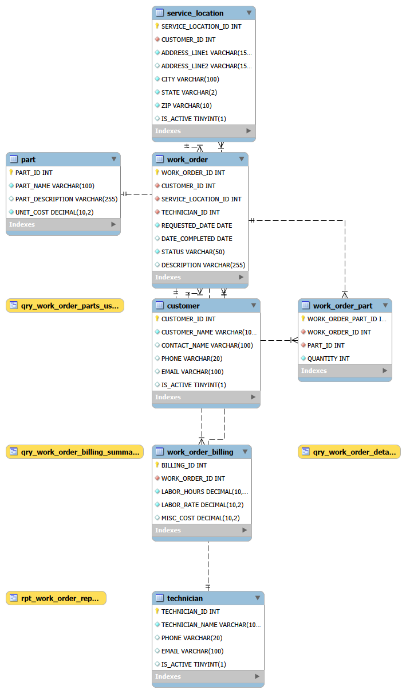

# Dave Smiley's Work Orders — MySQL Database

A relational database designed to manage work orders, customers, technicians, inventory, and billing for a field service or IT services company.

This project demonstrates database design, normalization, and reporting using MySQL.


## Features

- Fully normalized relational schema  
- Many-to-many relationship handling (`WORK_ORDER_PART`)  
- Aggregated billing and reporting views  
- Realistic sample data for testing  

---

## Database Overview

**Database name:** `DAVE_SMILEYS_WORK_ORDERS`

| Table                | Description                                           |
|----------------------|-------------------------------------------------------|
| `CUSTOMER`           | Companies and contacts being serviced                 |
| `SERVICE_LOCATION`   | Physical job site addresses per customer              |
| `TECHNICIAN`         | Field technicians assigned to work orders             |
| `WORK_ORDER`         | Core job records linking customer, location, and tech |
| `PART`               | Parts inventory with unit costs                       |
| `WORK_ORDER_PART`    | Parts used per work order (junction table)            |
| `WORK_ORDER_BILLING` | Labor hours, rate, and misc costs per work order      |

---

## Views

| View                          | Description                                           |
|-------------------------------|-------------------------------------------------------|
| `QRY_WORK_ORDER_DETAILS`      | Work order joined with customer, location, technician |
| `QRY_WORK_ORDER_PARTS_USED`   | Parts used per work order with line‑item totals       |
| `QRY_WORK_ORDER_BILLING_SUMMARY` | Labor totals per work order                       |
| `RPT_WORK_ORDER_REPORT`       | Full invoice‑style report with parts, labor, totals   |

---

## How to Run

Run the SQL files in this order:

1. `01_create_database.sql` — creates all tables and foreign keys  
2. `02_sample_data.sql` — inserts sample customers, techs, parts, and work orders  
3. `03_views.sql` — creates all QRY_ and RPT_ views  

Open each file in MySQL Workbench (or any MySQL client) and execute using the lightning bolt button or `Ctrl+Shift+Enter`.

**Requires:** MySQL 5.7+ or MySQL 8.x

---

## Sample Data Includes

- 5 customers (Indiana‑based public sector organizations)  
- 6 service locations  
- 3 technicians  
- 5 parts (networking equipment and supplies)  
- 5 work orders in various statuses (`COMPLETED`, `IN_PROGRESS`, `SCHEDULED`, `OPEN`)  
- Billing records for all work orders  

---

## Naming Conventions

- All object names in **ALL CAPS** with **underscores**  
- Table names are **singular** (`CUSTOMER`, not `CUSTOMERS`)  
- Primary keys follow the pattern `TABLENAME_ID`  
- Foreign key constraints named `FK_TABLENAME_COLUMNNAME`  
- Query views prefixed `QRY_`  
- Report views prefixed `RPT_`  

---

## Sample Query

```sql
-- Get a full financial summary for all completed work orders
SELECT 
    WORK_ORDER_ID, 
    CUSTOMER_NAME, 
    PARTS_TOTAL, 
    LABOR_TOTAL,  
    MISC_TOTAL,
    GRAND_TOTAL
FROM RPT_WORK_ORDER_REPORT 
WHERE STATUS = 'COMPLETED';
```


### Output Example

| WORK_ORDER_ID | CUSTOMER_NAME              | PARTS_TOTAL | LABOR_TOTAL | MISC_TOTAL | GRAND_TOTAL |
|---------------|----------------------------|-------------|-------------|------------|-------------|
| 1             | Anderson Community Schools | 439.89      | 617.50      | 12.50      | 1069.89     |
| 4             | Pendleton Fire Department  | 389.87      | 475.00      | 18.00      | 882.87      |

## Tools & Software Used

| Tool / Software     | Purpose                                        |
|---------------------|------------------------------------------------|
| MySQL 8.x           | Database engine for schema, views, and SQL     |
| MySQL Workbench     | Query execution, ERD design, and visualization |
| SQL (DDL & DML)     | Table creation, inserts, joins, reporting      |
| GitHub              | Version control and project documentation      |
| VS Code / Editor    | Editing SQL files and README.md                |

## Author

**William Lyle**  
Network+ certified IT professional specializing in database design, homelab engineering, and inspector‑proof documentation.  
Focused on building clean, reliable, enterprise‑grade systems with transparent workflows.


